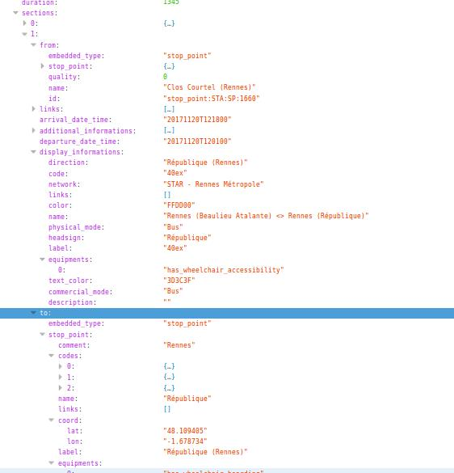
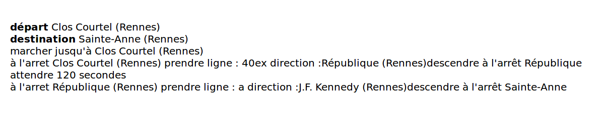

Projet Metromix :

Le projet comporte differentes briques :
- L'interface avec l'utilisateur qui est censé generer un fichier json contenant le trajet détaillé conseillé
- L'interface en ReactJS qui va analyser le fichier JSON pour créer le visuel du ticket à imprimer
- Une partie Hardware pour commander l'impression du visuel

Pour la 2ème partie, création du visuel :
  - Le visuel et créé à partir d'une application ReactJS
  - Cette application peut fonctionner en local sur un ordinateur dédié.
  - Cet ordinateur doit avoir les dernière version de nodeJS et NPM installée.
  - Pour lancer l' serveur en local :
  "npm start"

Le trajet au format JSON :

 

Le trajet traité par l'application REACT :

 

 Creation du visuel : Configuration du serveur

L'application ReactJS qui génère le visuel doit avoir un serveur qui tourne en back-end (non visible par l'utilisateur).
Sur le PC qui devra generer ce visuel doit donc avoir un serveur qui tourne en permanence. Ce serveur utilise la technologie NodeJS.

La 1ere étape est donc d'installer la dernière version de NodeJS :
https://nodejs.org/en/download/

Telecharger ensuite ce dépot git sur le PC.

Pour lancer le serveur 
- dans un terminal, aller dans la copie de ce dépot sur le PC
- lancer les commandes
>npm install
>npm start

Dans votre navigateur, à l'adresse "http://localhost:3000/" vous devrier voir l'application et donc le visuel du ticket à imprimer.
